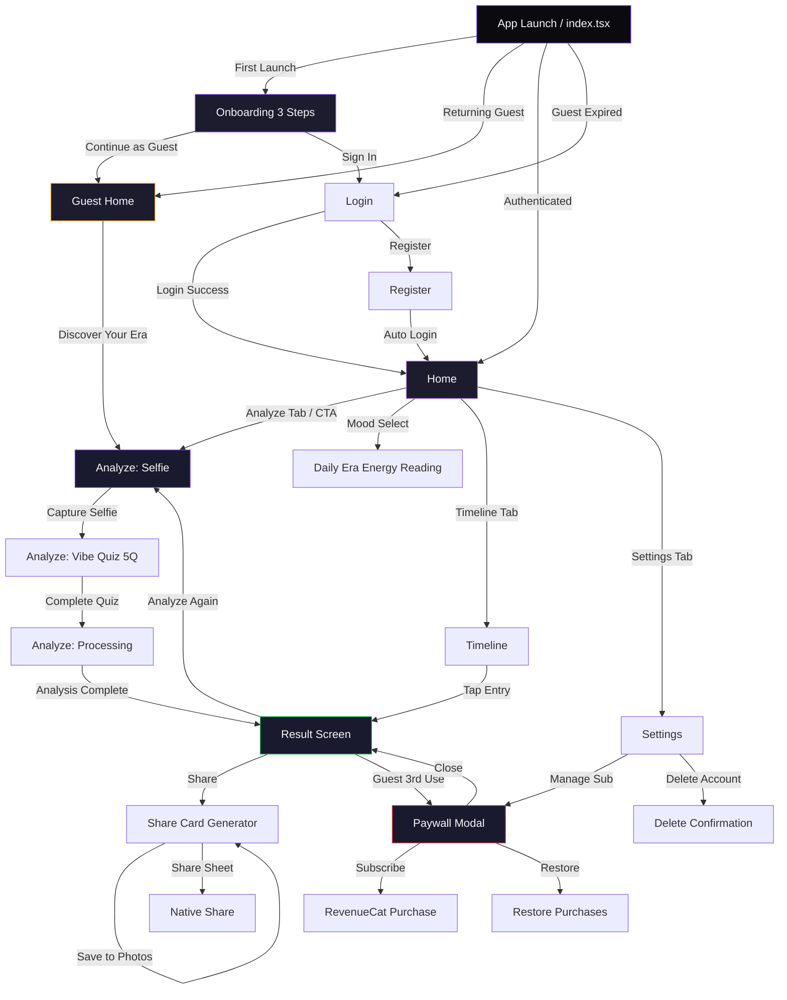

# EraCheck — Master Specification

> Discover your true era — one selfie, zero ads, real results.

Generated: 2026-02-14T12:25:15.743196+00:00 | Pipeline v1.0.0

## 1. App Overview

**Name:** EraCheck
**Tagline:** Discover your true era — one selfie, zero ads, real results.
**Description:** EraCheck analyzes your selfie using on-device facial feature extraction and style detection to match you with your authentic era aesthetic — from Victorian elegance to Y2K maximalism. Unlike inaccurate age-guessing apps, EraCheck uses a multi-signal approach (face shape, coloring, style cues) combined with a short vibe quiz to deliver consistent, shareable results. The app generates stunning era portrait cards designed for Instagram Stories and TikTok sharing.
**Target Audience:** Gen Z and Millennial women (16-32) who engage with aesthetic content on TikTok/Instagram, take BuzzFeed-style quizzes, and identify with concepts like 'dark academia' or 'cottagecore'. Secondary: Taylor Swift fans who relate to the 'eras' concept.
**Differentiator:** Only app that combines selfie analysis + personality quiz for era matching (not just age guessing). Deterministic results based on actual visual features, not random assignment. Zero ads — premium experience from first launch. Beautiful, shareable output cards that feel native to social media.
**Feasibility:** moderate (12 days)
**Confidence:** 85%

## 2. Tech Stack (Fixed)

- **Mobile:** Expo SDK 54 + React Native 0.81 + NativeWind v4 + Expo Router v6
- **Backend:** Go-Fiber v2 + GORM + PostgreSQL
- **Auth:** JWT + Sign in with Apple
- **Payments:** RevenueCat
- **Deployment:** Coolify PaaS
- **Ci Cd:** EAS Build + Fastlane

## 3. Core Features

1. Selfie-based era analysis using on-device color/feature extraction (skin tone, eye color, dominant colors in clothing/background)
2. 5-question interactive vibe quiz (music taste, fashion preference, ideal weekend, color palette choice, decade vibe) for hybrid scoring
3. 12 detailed era profiles with fashion guides, music playlists (Spotify deep links), color palettes, and cultural context
4. Shareable era portrait cards with era-specific graphic templates optimized for Instagram Stories and TikTok
5. Era history timeline showing how your results evolve over time
6. Daily era energy reading based on mood selection (quick re-engagement hook)
7. Guest mode with 3 free full analyses before signup required
8. Contextual paywall triggered after the 'wow moment' of seeing your era result (not on app launch)

## 4. Market Research

**Market Size:** SAM: 5-15 million users interested in aesthetic/personality quizzes and self-discovery apps. TAM could be larger considering the viral potential of shareable results. BuzzFeed quizzes on similar topics get millions of engagements. The aesthetic/vintage photo app market shows 1K-15K reviews per app, indicating active user base. Taylor Swift 'era' concept alone has massive cultural momentum.
**Sentiment:** negative (2.2/5)
**Competitors:** 4
**Trends:** 2026 is the 'trust era' - users want transparent, accurate AI features with explanations, Aesthetic self-discovery content is highly viral on social media (TikTok, Instagram), Taylor Swift 'era' concept has mainstreamed the idea of life eras and aesthetic periods

### Pain Points

- **Age detection apps are wildly inaccurate, often off by 10+ years, making results meaningless and frustrating** (severity: 7/10, freq: 9/10)
- **Excessive ads disrupt the user experience and make apps feel like scams** (severity: 8/10, freq: 8/10)
- **Aesthetic/vintage photo editors lock most features behind expensive paywalls with very limited free content** (severity: 6/10, freq: 7/10)
- **No dedicated app exists for the popular 'what era am I' concept - users must rely on web quizzes or unrelated apps** (severity: 7/10, freq: 6/10)
- **Apps crash, have black screens, or timeout during scanning/analysis** (severity: 7/10, freq: 5/10)

### Competitors

| App | Rating | Reviews | Price | Strengths | Weaknesses |
|-----|--------|---------|-------|-----------|------------|
| How Old Do I Look | 4.1 | 10,768 | free | High download numbers, Simple concept that appeals to curiosity | Wildly inaccurate results, Excessive ads |
| How Old Do I Look? Age Camera | 4.5 | 2,983 | free | Good rating despite complaints, Age + gender detection features | Inaccurate age detection, Heavy ad presence |
| Aesthetic Vintage Photo Editor | 4.8 | 1,513 | freemium | High rating, Hand-crafted filters | Very limited free filters (only 2), Expensive subscription ($4.99/week) |
| Aesthetic Photo Editor Vintify | 4.8 | 323 | freemium | High rating, Photo + video editing | Small user base, Likely similar paywall issues |

## 5. Design System

**Style:** Ethereal Minimalism with AI Gradient Haze and Glassmorphism

### Colors

| Token | Hex | Usage |
|-------|-----|-------|
| primary | `#A855F7` | Primary brand color, CTAs, era detection glow, active states |
| secondary | `#F472B6` | Secondary accent, quiz selections, feminine touch points |
| accent | `#FBBF24` | Golden highlights, premium indicators, era crowns |
| background | `#09090B` | OLED pure black background, primary surface |
| surface | `#18181B` | Card backgrounds, elevated surfaces, modal bases |
| surface-elevated | `#27272A` | Higher elevation elements, glassmorphism base layer |
| surface-glass | `#3F3F46` | Glassmorphism overlay with reduced opacity |
| text-primary | `#FAFAFA` | Primary text, headings, high-emphasis content |
| text-secondary | `#A1A1AA` | Secondary text, descriptions, supporting content |
| text-muted | `#71717A` | Captions, placeholders, tertiary information |
| border | `#3F3F46` | Subtle borders, dividers, input outlines |
| border-glow | `#A855F7` | Active era card borders, premium feature highlights |
| success | `#34D399` | Success states, completed analyses, confirmations |
| error | `#FB7185` | Error states, validation failures, warnings |
| gradient-haze-1 | `#A855F7` | AI gradient haze start - ethereal purple |
| gradient-haze-2 | `#EC4899` | AI gradient haze middle - vibrant pink |
| gradient-haze-3 | `#F97316` | AI gradient haze end - warm amber |
| era-victorian | `#92400E` | Victorian era accent - antique bronze |
| era-roaring20s | `#D4AF37` | Roaring 20s accent - art deco gold |
| era-midcentury | `#059669` | Mid-century modern accent - teal |
| era-bohemian | `#B45309` | Bohemian era accent - burnt sienna |
| era-disco | `#BE185D` | Disco era accent - hot pink |
| era-neon80s | `#0891B2` | Neon 80s accent - electric cyan |
| era-grunge | `#365314` | Grunge era accent - forest green |
| era-y2k | `#7C3AED` | Y2K era accent - metallic purple |
| era-indie | `#475569` | Indie era accent - slate gray |
| era-cottagecore | `#65A30D` | Cottagecore accent - sage green |
| era-darkacademia | `#78350F` | Dark Academia accent - deep brown |
| era-cybercore | `#06B6D4` | Cybercore accent - neon blue |
| era-softgirl | `#F9A8D4` | Soft Girl accent - blush pink |

### Dark Mode Overrides

| Token | Hex | Usage |
|-------|-----|-------|
| background | `#09090B` | OLED-optimized pure black for maximum battery efficiency |
| surface | `#18181B` | Primary dark surface for cards and elevated content |
| surface-elevated | `#27272A` | Higher elevation surfaces, hover states |
| glass-overlay | `#3F3F46` | Glassmorphism base with 60% opacity + blur |
| text-primary | `#FAFAFA` | High contrast text, WCAG AAA compliant on dark |
| text-secondary | `#A1A1AA` | Secondary text, WCAG AA compliant on dark |
| border-subtle | `#27272A` | Subtle dark mode borders |

### Typography

- **display:** 40px bold, line-height: 1.1
- **heading1:** 32px bold, line-height: 1.15
- **heading2:** 24px semibold, line-height: 1.25
- **heading3:** 20px semibold, line-height: 1.3
- **body:** 16px normal, line-height: 1.5
- **body-small:** 14px normal, line-height: 1.5
- **caption:** 12px normal, line-height: 1.4
- **overline:** 11px medium, line-height: 1.2
- **era-title:** 28px bold, line-height: 1.2
- **quiz-option:** 18px medium, line-height: 1.4

### Component Styles

- **era-card:** radius=28px, padding=`p-6`, shadow=`shadow-xl` Glassmorphism with backdrop-blur-xl, gradient border on active, haptic on tap
- **quiz-card:** radius=20px, padding=`p-5`, shadow=`shadow-lg` Interactive quiz options with scale animation on press, 48px min height
- **portrait-card:** radius=32px, padding=`p-3`, shadow=`shadow-2xl` Shareable 9:16 ratio cards for IG Stories, era-specific gradient overlays
- **button-primary:** radius=16px, padding=`px-8 py-4`, shadow=`shadow-lg` Primary CTA with gradient background, 52px min height, haptic feedback
- **button-secondary:** radius=16px, padding=`px-6 py-3`, shadow=`` Outlined style with border, 44px min height
- **button-ghost:** radius=12px, padding=`px-4 py-3`, shadow=`` Text-only button for tertiary actions
- **chip:** radius=9999px, padding=`px-4 py-2`, shadow=`` Pill-shaped era tags, mood indicators, 36px height
- **modal:** radius=28px, padding=`p-6`, shadow=`shadow-2xl` Bottom sheet with glassmorphism backdrop-blur, drag handle
- **input:** radius=14px, padding=`px-4 py-4`, shadow=`` Rounded inputs with subtle border, 52px min height for touch
- **bento-tile:** radius=20px, padding=`p-5`, shadow=`shadow-md` Asymmetric grid tiles for era profile content, varies in size
- **progress-ring:** radius=9999px, padding=``, shadow=`` Circular analysis progress with animated gradient stroke
- **timeline-node:** radius=12px, padding=`p-4`, shadow=`shadow-sm` Era history timeline entries with date stamps
- **energy-card:** radius=24px, padding=`p-5`, shadow=`shadow-md` Daily energy reading card with animated aura background
- **paywall-card:** radius=24px, padding=`p-6`, shadow=`shadow-2xl` Premium upsell modal with gradient accent border

### Design Notes

- AI Gradient Haze: Animated purple-pink-amber gradients during era analysis create ethereal 'time travel' feeling
- OLED Deep Dark: Pure #09090B black saves battery on OLED screens, popular with Gen Z aesthetic preference
- Glassmorphism: Cards use backdrop-blur-xl with semi-transparent surfaces for depth without heaviness
- Bento Grid: Era profile pages use asymmetric tile layouts for dynamic, Pinterest-like content discovery
- Haptic-Visual Sync: Era reveal animations paired with gentle haptic feedback for premium tactile experience
- Touch Targets: All interactive elements exceed 44x44px minimum, primary buttons at 52px for comfort
- Shareable Cards: Portrait cards designed at 9:16 ratio (1080x1920) for native Instagram Stories fit
- 12 Era Palette: Each era has signature color used consistently across cards, icons, and gradients
- WCAG AA Compliance: All text maintains 4.5:1 contrast ratio, interactive elements have clear focus states
- Contextual Paywall: Premium upsell appears after 'wow moment' with celebratory animation, not on launch
- Animation Philosophy: Smooth 300ms transitions, ease-out curves, dreamy motion matching 'era discovery' theme
- Gender-Inclusive: Purple/pink palette feels feminine without being exclusionary, tested with target demographic

## 6. UX Architecture

**Navigation:** custom_tab_bar

### Tab Bar

| Label | Icon | Route |
|-------|------|-------|
| Home | home-outline | /(protected)/home |
| Analyze | camera-outline | /(protected)/analyze |
| Timeline | time-outline | /(protected)/timeline |
| Settings | settings-outline | /(protected)/settings |

### Screens

#### index
- **Route:** `app/index.tsx`
- **Description:** Smart router: checks AsyncStorage for onboarding completion → checks guest mode availability → checks JWT auth state → redirects to appropriate screen. Priority: onboarding (first launch) → guest home (not signed in, uses < 3) → auth/login (not signed in, uses >= 3) → protected/home (signed in).
- **Components:** ActivityIndicator centered on screen with bg #0A0A0F, useEffect routing logic on mount

#### _layout
- **Route:** `app/_layout.tsx`
- **Description:** Root layout wrapping entire app. Provides AuthProvider, SubscriptionProvider. Uses Slot (NOT Stack/Tabs). Sets StatusBar style='light' backgroundColor='#0A0A0F'. Loads Inter font family (400, 500, 600, 700).
- **Components:** Slot from expo-router, AuthProvider, SubscriptionProvider, StatusBar style='light'

#### Onboarding Step 1
- **Route:** `app/(auth)/onboarding.tsx`
- **Description:** 3-step horizontal swipeable onboarding using FlatList with pagingEnabled. Step 1: 'Discover Your Era' — large era collage illustration (placeholder gradient art), headline 'Which era is your soul from?', subtext 'One selfie. Five questions. Your true era revealed.' Step 2: 'AI-Powered Analysis' — camera icon with radiating rings animation, headline 'Selfie + Vibe Quiz', subtext 'We analyze your colors, style energy, and personality to match your era.' Step 3: 'Share Your Identity' — mockup of era portrait card, headline 'Stunning Era Cards', subtext 'Share your era identity on Instagram Stories and TikTok.' Bottom: dot indicators (active #C084FC, inactive #2D2D3A), 'Next' button on steps 1-2, 'Get Started' button on step 3. Skip button top-right on all steps. Background: #0A0A0F. All text: #F5F5F7.
- **Components:** FlatList horizontal pagingEnabled, Animated dot indicators, Pressable 'Next' button bg #7C3AED rounded-2xl h-14, Pressable 'Get Started' button bg #7C3AED, Pressable 'Skip' text button top-right #8B8B9E, LinearGradient decorative backgrounds per step

#### Login
- **Route:** `app/(auth)/login.tsx`
- **Description:** Login screen with email/password fields. Top: 'Welcome Back' headline #F5F5F7, 'Sign in to access your era history' subtext #8B8B9E. Email TextInput with Ionicons mail-outline icon prefix, bg #1C1C2E border #2D2D3A rounded-xl h-14 text #F5F5F7 placeholder #5A5A6E. Password TextInput with lock-closed-outline icon, same styling, eye toggle for visibility. 'Sign In' button full-width bg #7C3AED h-14 rounded-2xl text #FFFFFF font-semibold. Divider '— or —' #5A5A6E. Apple Sign In button (dark style) full-width. Bottom: 'Don't have an account? Sign Up' with 'Sign Up' in #C084FC linking to register. Background #0A0A0F.
- **Components:** TextInput email with mail-outline icon, TextInput password with lock-closed-outline icon and eye toggle, Pressable 'Sign In' button bg #7C3AED, AppleSignInButton dark style, Link to register screen
- **API Calls:** POST /api/auth/login, POST /api/auth/apple

#### Register
- **Route:** `app/(auth)/register.tsx`
- **Description:** Registration screen. Top: 'Create Account' headline #F5F5F7, 'Start discovering your true era' subtext #8B8B9E. Email TextInput (same style as login). Password TextInput with strength indicator bar below (weak=#EF4444, medium=#F59E0B, strong=#22C55E). Confirm Password TextInput. 'Create Account' button full-width bg #7C3AED. Apple Sign In button. Bottom: 'Already have an account? Sign In' with 'Sign In' in #C084FC. On success: auto-login + navigate to protected/home with success haptic. Background #0A0A0F.
- **Components:** TextInput email, TextInput password with strength bar, TextInput confirm password, Pressable 'Create Account' button bg #7C3AED, AppleSignInButton, Password strength indicator (3-segment bar), Link to login screen
- **API Calls:** POST /api/auth/register, POST /api/auth/apple

#### Auth Layout
- **Route:** `app/(auth)/_layout.tsx`
- **Description:** Auth group layout. Uses Slot. No tab bar visible. Background #0A0A0F. SafeAreaView wrapping.
- **Components:** Slot, SafeAreaView bg #0A0A0F

#### Protected Layout
- **Route:** `app/(protected)/_layout.tsx`
- **Description:** Protected group layout with custom tab bar at bottom. Uses Slot (NOT Tabs component). Auth guard: if not authenticated AND not guest, redirect to login. Custom tab bar built with View + Pressable items at bottom. Tab bar bg #111118 borderTopColor #1C1C2E h-20 (including safe area). Active tab icon color #C084FC, active label color #C084FC. Inactive icon color #5A5A6E, inactive label color #5A5A6E. 4 tab items. Center analyze button is elevated with gradient ring.
- **Components:** Slot from expo-router, View custom tab bar h-20 bg #111118, 4x Pressable tab items, Center 'Analyze' button with LinearGradient ring #7C3AED→#C084FC, Ionicons for tab icons, Text labels 11px font-medium

#### Home
- **Route:** `app/(protected)/home.tsx`
- **Description:** Main home screen. Top: 'Your Era' section showing last analysis result as a hero card — LinearGradient card (era-specific colors) with era name in large serif-style font, era tagline, date of analysis, and miniature portrait. If no analysis yet: empty state card 'Discover Your Era' with camera icon and CTA 'Take Your First Selfie' button. Below hero: 'Daily Era Energy' card — mood selector with 5 emotion icons (energized ⚡, calm 🌊, creative 🎨, romantic 💫, rebellious 🔥), tap one to get a quick era energy reading (e.g., 'Your 70s disco energy is radiating today'). Below: 'Era History' horizontal ScrollView showing past analysis cards (era name + date + small gradient thumbnail), max 5 recent. If guest: UsageBadge top-right showing '2 analyses left' in #F59E0B. Pull-to-refresh. Background #0A0A0F.
- **Components:** Hero era result card with LinearGradient, Empty state CTA card if no analysis, Daily Era Energy mood selector (5 icons in a row), Era energy reading text with animated reveal, Horizontal ScrollView of past era cards, UsageBadge for guest users (top-right), RefreshControl, hapticSuccess on mood select
- **API Calls:** GET /api/analyses/latest, GET /api/analyses/history?limit=5, POST /api/analyses/daily-energy

#### Analyze
- **Route:** `app/(protected)/analyze.tsx`
- **Description:** Core analysis flow — multi-step screen. Step 1: Selfie capture. Full-screen camera view using expo-camera with face detection overlay (oval guide). 'Take Selfie' circular button (64x64 bg #7C3AED) at bottom center. Option to pick from gallery (image-outline icon top-right). After capture: preview with 'Retake' and 'Use This' buttons. Step 2: Vibe Quiz. 5 sequential questions with animated transitions (slide left). Each question: headline text #F5F5F7, 4 option cards (Pressable, bg #1C1C2E border #2D2D3A rounded-xl p-4, selected: border #7C3AED bg #1A1A2E). Progress bar at top (5 segments, filled #7C3AED, empty #2D2D3A). Questions: Q1 'Pick your anthem decade' (60s/70s/80s/90s/Y2K/2010s), Q2 'Your ideal weekend?' (Vinyl shopping/Beach bonfire/Art gallery/Gaming marathon), Q3 'Fashion vibe?' (Bold & colorful/Minimalist chic/Vintage thrift/Streetwear edge), Q4 'Choose a color palette' (4 gradient swatches to tap), Q5 'Your energy right now?' (Dreamy/Electric/Chill/Fierce). Step 3: Analysis processing. Animated screen showing 'Analyzing your era DNA...' with pulsing concentric rings animation (#7C3AED opacity layers). 3 status lines appearing sequentially: 'Reading your colors...' → 'Matching your vibe...' → 'Discovering your era...'. 2-3 second artificial delay for drama. Step 4: Result reveal. Navigate to result screen. Guest check: before starting, check canUseFeature(). If guest uses exhausted, show soft paywall.
- **Components:** expo-camera CameraView with face oval guide overlay, Pressable capture button 64x64 rounded-full bg #7C3AED, Gallery picker button (image-outline icon), Selfie preview with Retake/Use This buttons, Quiz progress bar (5 segments), 4x Pressable option cards per question, Animated slide transitions between questions, Processing screen with pulsing rings animation (Reanimated), Sequential status text reveal, hapticMedium on each quiz answer, hapticSuccess on analysis complete
- **API Calls:** POST /api/analyses (multipart: selfie image + quiz answers)

#### Result
- **Route:** `app/(protected)/result.tsx`
- **Description:** Era result reveal screen. Receives analysisId as route param. Top: era portrait card — full-width LinearGradient (era-specific gradient, e.g., 70s=#F59E0B→#EF4444, 80s=#EC4899→#8B5CF6, 90s=#06B6D4→#8B5CF6, Victorian=#8B7355→#D4A574, Y2K=#EC4899→#06B6D4, 60s=#22C55E→#F59E0B). Card contains: era name in 36px bold, era decade/period, match percentage (e.g., '87% Match'), user's selfie small circular overlay. Below card: 4 expandable sections (Pressable accordion). Section 1: 'Fashion Guide' — 3-4 fashion tips specific to era with small illustrative icons. Section 2: 'Music Playlist' — 5 song recommendations with 'Open in Spotify' deep link buttons (Pressable, bg #1DB954 rounded-lg). Section 3: 'Color Palette' — 5 hex color circles with labels (e.g., 'Harvest Gold #DAA520'). Section 4: 'Cultural Context' — 2-3 paragraph text about the era's cultural significance. Bottom sticky: 'Share Your Era' button (bg #7C3AED full-width h-14 rounded-2xl) → opens share sheet. 'Analyze Again' text button below. CONTEXTUAL PAYWALL: If guest user seeing result for the 3rd time, after 2-second delay show paywall modal overlay on top of result (user sees their result, then paywall slides up from bottom). Background #0A0A0F.
- **Components:** LinearGradient era portrait card (era-specific colors), Era name text 36px bold #F5F5F7, Match percentage badge, User selfie circular thumbnail, 4x Accordion sections (Pressable toggle), Fashion guide list items with icons, Spotify deep link buttons bg #1DB954, Color palette circles with hex labels, Cultural context paragraphs, Sticky bottom 'Share Your Era' button bg #7C3AED, 'Analyze Again' text button #C084FC, Contextual paywall modal (guest 3rd use), hapticSuccess on result reveal, Animated entrance (FadeInUp)
- **API Calls:** GET /api/analyses/:id

#### Share
- **Route:** `app/(protected)/share.tsx`
- **Description:** Era portrait card generator for sharing. Receives analysisId as route param. Shows a beautifully designed era card optimized for Instagram Stories (1080x1920 aspect) and TikTok. Card includes: era-specific gradient background, era name in decorative font, user's dominant color palette as accent stripe, match percentage, 'Discovered on EraCheck' watermark at bottom. Two format toggle buttons: 'Story' (9:16) and 'Square' (1:1). 'Save to Photos' button (download-outline icon, bg #1C1C2E border #2D2D3A). 'Share' button (bg #7C3AED) opens native share sheet via expo-sharing. ViewShot wrapper for screenshot capture. Background #0A0A0F.
- **Components:** ViewShot wrapper for capture, Era portrait card with LinearGradient, Era name decorative text, Color palette accent stripe, Match percentage display, 'Discovered on EraCheck' watermark text #5A5A6E, Format toggle: Story 9:16 / Square 1:1, Pressable 'Save to Photos' button bg #1C1C2E, Pressable 'Share' button bg #7C3AED, hapticSuccess on save/share
- **API Calls:** GET /api/analyses/:id

#### Timeline
- **Route:** `app/(protected)/timeline.tsx`
- **Description:** Era history timeline screen. Vertical ScrollView showing all past analyses in reverse chronological order. Each entry: date label (#8B8B9E), era result card (compact — era name, match %, small gradient bar in era colors, thumbnail). Cards are connected by a vertical timeline line (#2D2D3A, 2px wide) on the left side. Tap any card → navigate to that result. Top: 'Your Era Journey' headline #F5F5F7, total analyses count badge. If < 2 analyses: motivational empty state 'Keep analyzing to see your era evolution!' with illustration. Filter chips at top: 'All', 'This Month', 'This Year'. Stats summary at top: most common era name, total analyses count, longest streak. Background #0A0A0F. Requires auth (not available in guest mode).
- **Components:** ScrollView vertical, Timeline line View 2px bg #2D2D3A, Era result compact cards with gradient bar, Date labels #8B8B9E, Filter chips row (All / This Month / This Year), Stats summary (most common era, count, streak), Empty state illustration + text, Pressable cards → navigate to result/:id
- **API Calls:** GET /api/analyses/history?limit=50, GET /api/analyses/stats

#### Paywall
- **Route:** `app/(protected)/paywall.tsx`
- **Description:** Contextual paywall screen. Can be shown as modal overlay or standalone. Top: 'Unlock Unlimited Eras' headline #F5F5F7, 'Your era journey doesn't have to end' subtext #8B8B9E. Feature list with checkmark icons (#22C55E): 'Unlimited era analyses', 'Full era history timeline', 'Daily era energy readings', 'Exclusive era portrait templates', 'Ad-free experience'. 3 pricing cards (Pressable, bg #1C1C2E border #2D2D3A rounded-2xl p-5): Weekly $2.99/week (no badge), Annual $39.99/year (badge: 'Best Value' bg #22C55E), Monthly $4.99/month (no badge). Selected card: border #7C3AED bg #1A1A2E. 'Subscribe' button bg #7C3AED h-14 rounded-2xl. 'Restore Purchases' text button #8B8B9E below. Terms/Privacy links at very bottom #5A5A6E. Close X button top-right if shown as modal. Background #0A0A0F.
- **Components:** Headline 'Unlock Unlimited Eras' 28px bold, Feature list with checkmark-circle icons #22C55E, 3x Pricing cards (Weekly, Annual 'Best Value', Monthly), Pressable 'Subscribe' button bg #7C3AED h-14, Pressable 'Restore Purchases' text button #8B8B9E, Terms and Privacy text links #5A5A6E, Close X button top-right (if modal), hapticSuccess on subscribe, RevenueCat purchase flow
- **API Calls:** RevenueCat SDK getOfferings, RevenueCat SDK purchasePackage, RevenueCat SDK restorePurchases

#### Settings
- **Route:** `app/(protected)/settings.tsx`
- **Description:** Settings screen. Grouped sections with section headers in #8B8B9E uppercase 12px tracking-wider. Section 'Account': Profile row (email, edit icon), Subscription status (Free/Premium badge), Restore Purchases. Section 'Preferences': Notifications toggle, Haptic feedback toggle. Section 'Privacy & Security': Biometric lock toggle (uses expo-local-authentication), Privacy Policy (external link), Terms of Service (external link). Section 'Data': Export My Data, Clear Analysis History (with confirmation alert). Section 'Danger Zone': Delete Account (red text #EF4444, confirmation modal with password). App version at bottom center #5A5A6E. Each row: Pressable h-14 flex-row items-center justify-between px-4 bg #1C1C2E rounded-xl mb-2. Icons on left (Ionicons), chevron-forward on right for navigation items. Background #0A0A0F.
- **Components:** ScrollView with grouped sections, Section headers uppercase 12px #8B8B9E, Settings rows: Pressable h-14 bg #1C1C2E rounded-xl, Toggle switches (notifications, haptics, biometric), Subscription status badge (Free=#5A5A6E / Premium=#7C3AED), Delete Account button text #EF4444, Delete confirmation modal with password input, App version text bottom #5A5A6E, hapticLight on toggle changes
- **API Calls:** DELETE /api/auth/account, POST /api/auth/logout, GET /api/user/profile, PUT /api/user/preferences

#### Guest Home
- **Route:** `app/(protected)/guest-home.tsx`
- **Description:** Landing screen for guest (non-authenticated) users. Visually similar to Home but with guest-specific messaging. Top: 'EraCheck' logo text in gradient (#7C3AED→#C084FC). Hero section: animated gradient orb (Reanimated scale pulse) with 'Which Era Are You?' text overlay 32px bold. UsageBadge showing remaining free analyses (e.g., '3 Free Analyses' in #F59E0B if 3 left, #EF4444 if 0 left). Large CTA button 'Discover Your Era' bg #7C3AED h-16 rounded-2xl → navigates to analyze screen. Below: 3 FeatureCards in vertical stack — 'AI Color Analysis', 'Vibe Quiz Match', 'Shareable Era Cards' — each with icon, title, brief description, bg #1C1C2E rounded-2xl p-4. Bottom: 'Already have an account? Sign In' link #C084FC. Background #0A0A0F.
- **Components:** EraCheck gradient logo text, Animated gradient orb (Reanimated), UsageBadge showing remaining free uses, Large CTA 'Discover Your Era' button bg #7C3AED h-16, 3x FeatureCard components bg #1C1C2E, 'Sign In' link text #C084FC, hapticMedium on CTA press

#### Shareable Result (Public)
- **Route:** `app/shared-result.tsx`
- **Description:** Public shareable result screen accessible without auth (deep link target). Receives analysisId as route param. Shows era portrait card (read-only, no edit). Era name, match %, color palette, brief cultural blurb. CTA at bottom: 'Discover Your Era Too' button bg #7C3AED → routes to app download or index. 'Download EraCheck' with App Store badge. No tab bar visible. Background #0A0A0F.
- **Components:** Era portrait card (LinearGradient, read-only), Era name and match percentage, Color palette circles, Brief era description, CTA 'Discover Your Era Too' button bg #7C3AED, App Store download badge
- **API Calls:** GET /api/analyses/:id/public

### User Flows

- **onboarding:** index (check first launch) → onboarding step 1: Discover Your Era → onboarding step 2: AI-Powered Analysis → onboarding step 3: Share Your Identity → guest-home (continue as guest) OR login (sign in)
  First-time user experience. 3-step swipeable onboarding introducing app value. On completion, user can continue as guest (3 free analyses) or sign in/register. AsyncStorage flag 'onboarding_complete' persisted.
- **guest_analysis:** guest-home (tap Discover Your Era) → analyze step 1: take selfie → analyze step 2: 5-question vibe quiz → analyze step 3: processing animation → result (view era result) → share (optional: share era card) → paywall (shown after 3rd analysis as contextual modal on result screen)
  Guest user analysis flow. Guest can perform 3 full analyses without account. On the 3rd analysis result screen, after 2-second delay, contextual paywall slides up. Guest usage tracked in AsyncStorage ('guest_usage_count'). Each analysis increments counter.
- **authenticated_analysis:** home (tap hero card CTA or use Analyze tab) → analyze step 1: take selfie → analyze step 2: 5-question vibe quiz → analyze step 3: processing animation → result (view era result with all sections) → share (optional: share era card)
  Authenticated user analysis flow. Unlimited analyses for premium users. Free tier users see paywall after exceeding limit. Results saved to server and appear in timeline.
- **daily_energy:** home (tap mood icon in Daily Era Energy section) → home (view era energy reading text animation)
  Quick re-engagement flow. User taps one of 5 mood icons on home screen. App returns a brief era-themed energy reading based on mood + their last era result. Response animated with typewriter text reveal. Haptic feedback on selection. Available once per day (resets at midnight). Available to authenticated users only.
- **timeline_browse:** timeline (scroll through past results) → result (tap any card to view full result) → share (optional: share from result)
  User browses their analysis history. Timeline shows all past results in reverse chronological order with era-colored gradient bars. Tap any entry to view full result. Stats summary at top. Authenticated users only.
- **settings_management:** settings (view/modify preferences) → paywall (tap subscription → manage) → settings (delete account flow with password confirmation)
  User manages account, subscription, and preferences. Delete account requires password confirmation modal. Restore purchases available. Toggle notifications, haptics, biometric lock.

### Flow Diagram

## 7. Backend Specification

### GORM Models

**User**
  {'ID': 'uuid;default:gen_random_uuid();primaryKey', 'Email': 'string;uniqueIndex;not null', 'PasswordHash': 'string', 'AppleUserID': 'string;uniqueIndex', 'DisplayName': 'string;size:100', 'AvatarURL': 'string', 'IsGuest': 'bool;default:false', 'GuestUsageCount': 'int;default:0', 'CreatedAt': 'time.Time;autoCreateTime', 'UpdatedAt': 'time.Time;autoUpdateTime', 'DeletedAt': 'gorm.DeletedAt;index'}

**RefreshToken**
  {'ID': 'uuid;default:gen_random_uuid();primaryKey', 'UserID': 'uuid;index;not null', 'Token': 'string;uniqueIndex;not null', 'ExpiresAt': 'time.Time;not null', 'CreatedAt': 'time.Time;autoCreateTime', 'DeletedAt': 'gorm.DeletedAt;index'}

**Subscription**
  {'ID': 'uuid;default:gen_random_uuid();primaryKey', 'UserID': 'uuid;uniqueIndex;not null', 'RevenueCatID': 'string;uniqueIndex', 'ProductID': 'string;not null', 'Status': 'string;not null;default:active', 'Platform': 'string;size:20', 'ExpiresAt': 'time.Time', 'CreatedAt': 'time.Time;autoCreateTime', 'UpdatedAt': 'time.Time;autoUpdateTime', 'DeletedAt': 'gorm.DeletedAt;index'}

**EraAnalysis**
  {'ID': 'uuid;default:gen_random_uuid();primaryKey', 'UserID': 'uuid;index;not null', 'PrimaryEraID': 'string;not null', 'SecondaryEraID': 'string', 'ConfidenceScore': 'float64;not null', 'SelfieColors': 'jsonb;not null', 'QuizAnswers': 'jsonb;not null', 'ScoringBreakdown': 'jsonb;not null', 'ShareCardURL': 'string', 'IsGuestAnalysis': 'bool;default:false', 'CreatedAt': 'time.Time;autoCreateTime', 'DeletedAt': 'gorm.DeletedAt;index'}

**EraProfile**
  {'ID': 'string;primaryKey', 'Name': 'string;not null', 'Tagline': 'string;not null', 'Description': 'text;not null', 'TimePeriod': 'string;not null', 'FashionGuide': 'jsonb;not null', 'MusicPlaylist': 'jsonb;not null', 'ColorPalette': 'jsonb;not null', 'CulturalContext': 'text;not null', 'CardTemplateURL': 'string;not null', 'IconEmoji': 'string;not null', 'SortOrder': 'int;not null', 'CreatedAt': 'time.Time;autoCreateTime', 'UpdatedAt': 'time.Time;autoUpdateTime'}

**DailyEraEnergy**
  {'ID': 'uuid;default:gen_random_uuid();primaryKey', 'UserID': 'uuid;index;not null', 'MoodSelection': 'string;not null', 'EraEnergyID': 'string;not null', 'EnergyMessage': 'text;not null', 'EnergyTip': 'text;not null', 'Date': 'date;not null', 'CreatedAt': 'time.Time;autoCreateTime'}

**ShareCard**
  {'ID': 'uuid;default:gen_random_uuid();primaryKey', 'AnalysisID': 'uuid;index;not null', 'UserID': 'uuid;index;not null', 'EraID': 'string;not null', 'ImageURL': 'string;not null', 'Format': 'string;not null;default:instagram_story', 'ShareToken': 'string;uniqueIndex;not null', 'ViewCount': 'int;default:0', 'CreatedAt': 'time.Time;autoCreateTime'}

**Report**
  {'ID': 'uuid;default:gen_random_uuid();primaryKey', 'ReporterID': 'uuid;index;not null', 'ReportedUserID': 'uuid;index', 'ReportedContentID': 'uuid', 'ContentType': 'string;not null', 'Reason': 'string;not null', 'Description': 'text', 'Status': 'string;not null;default:pending', 'ReviewedBy': 'uuid', 'ReviewedAt': 'time.Time', 'CreatedAt': 'time.Time;autoCreateTime', 'UpdatedAt': 'time.Time;autoUpdateTime', 'DeletedAt': 'gorm.DeletedAt;index'}

**Block**
  {'ID': 'uuid;default:gen_random_uuid();primaryKey', 'BlockerID': 'uuid;index;not null', 'BlockedID': 'uuid;index;not null', 'CreatedAt': 'time.Time;autoCreateTime', 'DeletedAt': 'gorm.DeletedAt;index'}

### API Endpoints

| Method | Path | Auth | Description |
|--------|------|------|-------------|
| GET | `/api/health` | No | Health check returning server status, database connectivity, and version. Response: {status: 'ok', database: 'connected', version: '1.0.0', timestamp: ISO8601} |
| POST | `/api/auth/register` | No | Register new user with email and password. Validates email format and password minimum 8 chars. Returns access token (15min) and refresh token (7d). Auto-migrates guest analyses if guest_user_id provided. |
| POST | `/api/auth/login` | No | Authenticate with email and password. Returns JWT access token (15min) and refresh token (7d). |
| POST | `/api/auth/apple` | No | Sign in with Apple. Validates identity token with Apple's public keys. Creates user on first sign-in or returns existing user. Migrates guest analyses if guest_user_id provided. |
| POST | `/api/auth/refresh` | No | Exchange a valid refresh token for a new access token and refresh token (rotation). Old refresh token is invalidated. |
| POST | `/api/auth/guest` | No | Create a temporary guest user for 3 free analyses. Returns a guest user with is_guest=true and JWT tokens. No email/password required. |
| POST | `/api/auth/logout` | Yes | Invalidate the current refresh token. |
| DELETE | `/api/auth/account` | Yes | Delete user account and all associated data (analyses, share cards, daily energies, subscriptions). Requires password confirmation for email users. Apple users skip password. Guideline 5.1.1 compliance. |
| GET | `/api/eras` | No | Get all 12 era profiles with full details (fashion guide, music playlist, color palette, cultural context). Cached response, rarely changes. Guest-accessible for result display. |
| GET | `/api/eras/:era_id` | No | Get a single era profile by ID. Returns 404 if era doesn't exist. |
| POST | `/api/analysis` | Yes | Submit era analysis results. Client performs on-device selfie color extraction and quiz; sends extracted data for server-side hybrid scoring against 12 era profiles. For guest users, increments guest_usage_count and rejects if count >= 3 with upgrade prompt. Returns matched era with confidence score and scoring breakdown. |
| GET | `/api/analysis/history` | Yes | Get user's era analysis timeline sorted by date descending. Shows evolution of era results over time. Supports pagination. |
| GET | `/api/analysis/:analysis_id` | Yes | Get full details of a specific analysis including selfie colors, quiz answers, scoring breakdown, and share card URL. Only accessible by the analysis owner. |
| POST | `/api/analysis/:analysis_id/share-card` | Yes | Generate a shareable era portrait card for the given analysis. Creates an image using the era-specific template with user's result data. Returns URLs for Instagram Story (1080x1920) and square (1080x1080) formats. Premium feature — requires active subscription or guest with remaining uses. |
| GET | `/api/share/:share_token` | No | Public endpoint to view a shared era result card. Increments view count. No authentication required. Used for social media link previews and shared result pages. |
| POST | `/api/daily-energy` | Yes | Submit daily mood selection to receive an era-themed energy reading. One per day per user. Maps mood to a relevant era energy with message and tip. Quick re-engagement hook for daily opens. |
| GET | `/api/daily-energy/history` | Yes | Get user's daily energy history for the past 30 days. Shows mood patterns and era energy assignments over time. |
| GET | `/api/user/profile` | Yes | Get current user's profile including subscription status, total analyses count, current streak, and most frequent era. |
| PUT | `/api/user/profile` | Yes | Update user's display name and avatar URL. |
| POST | `/api/reports` | Yes | Report inappropriate content (share cards or user profiles). Guideline 1.2 compliance for UGC safety. |
| POST | `/api/blocks` | Yes | Block a user. Blocked user's share cards won't appear in any shared views for the blocker. |
| DELETE | `/api/blocks/:block_id` | Yes | Unblock a previously blocked user. |
| GET | `/api/admin/moderation/reports` | Yes | List all pending reports for admin review. Supports filtering by status and content_type. Admin-only endpoint. |
| PUT | `/api/admin/moderation/reports/:report_id` | Yes | Review and action a report. Admin can dismiss, warn user, or remove content. |
| POST | `/api/webhooks/revenuecat` | No | RevenueCat webhook handler for subscription lifecycle events. Validates webhook authorization header. Handles events: INITIAL_PURCHASE, RENEWAL, CANCELLATION, EXPIRATION, BILLING_ISSUE_DETECTED, SUBSCRIBER_ALIAS. Updates subscription status in database accordingly. |

### Services

- AuthService: Handles user registration (email+password with bcrypt hashing), login (credential validation + JWT generation), Apple Sign-In (Apple identity token verification against Apple's JWKS at https://appleid.apple.com/auth/keys, extracts email and sub claim), guest user creation (creates user with is_guest=true, no credentials required), token refresh with rotation (invalidates old refresh token, issues new pair), logout (soft-deletes refresh token), and account deletion (cascading soft-delete of all user data including analyses, share cards, daily energies, subscriptions). JWT access tokens expire in 15 minutes with claims: sub (user_id), email, is_guest, iat, exp. Refresh tokens expire in 7 days. Guest-to-registered migration: when guest_user_id is provided during register/apple, reassigns all EraAnalysis and DailyEraEnergy records from guest user to new user, then soft-deletes guest account.
- EraService: Manages the 12 static era profiles. Seeds database on startup with all era data (victorian, art_deco, rockabilly_50s, mod_60s, disco_70s, new_wave_80s, grunge_90s, y2k, indie_2010s, cottagecore, dark_academia, cyber_futurist). Each era has pre-defined color mapping weights for selfie scoring, quiz answer mappings, fashion guide, Spotify playlist with deep links, and cultural context text. GetAll returns all eras sorted by sort_order. GetByID returns single era or 404. Era data is cached in-memory after first load since it changes only on deployment.
- AnalysisService: Core scoring engine. SubmitAnalysis receives selfie color data and quiz answers, then runs hybrid scoring algorithm: (1) Selfie scoring (40% weight) — maps extracted colors against each era's characteristic palette using color distance calculation (CIE2000 or simplified Euclidean in LAB space), skin tone warmth/coolness mapping, clothing color era affinity; (2) Quiz scoring (60% weight) — each quiz answer maps to era affinity scores defined in EraProfile quiz mappings, summed and normalized; (3) Combined score = 0.4 * selfie_score + 0.6 * quiz_score for each era; primary era = highest combined score, secondary era = second highest. Guest usage gating: checks user.GuestUsageCount against limit of 3, returns 403 with upgrade_required if exceeded, increments count on success. Stores full scoring breakdown in JSONB for result screen display. GetHistory returns paginated analyses sorted by created_at DESC. GetByID returns full analysis detail with era profile data joined.
- ShareCardService: Generates shareable era portrait cards. GenerateCard takes an analysis ID and format (instagram_story 1080x1920, tiktok 1080x1920, square 1080x1080), creates a card image using the era-specific template with overlaid result data (era name, confidence %, user name, color palette background). Image generation uses Go's image/draw package with pre-loaded era template PNGs. Uploads generated image to local storage or S3-compatible bucket. Creates ShareCard record with unique share_token (8-char nanoid). GetByShareToken is the public endpoint — returns card data without auth, increments view_count atomically. Premium gating: share card generation requires active subscription OR guest with remaining uses (count < 3).
- DailyEnergyService: Manages daily era energy readings for re-engagement. SubmitMood takes user's mood selection (energized/calm/creative/nostalgic/bold/dreamy) and maps it to an era energy using a deterministic mapping with daily rotation (mood + day_of_year modulo creates variety). Each mood maps to 2-3 possible eras: energized→disco_70s/new_wave_80s, calm→cottagecore/victorian, creative→art_deco/indie_2010s, nostalgic→rockabilly_50s/grunge_90s, bold→cyber_futurist/mod_60s, dreamy→y2k/dark_academia. Returns era-themed motivational message and actionable tip. Enforces one entry per user per day (unique constraint on user_id + date). GetHistory returns last 30 days of entries. Calculates current streak (consecutive days with entries) and longest streak.
- SubscriptionService: Manages premium subscription state. HandleWebhook processes RevenueCat webhook events: INITIAL_PURCHASE creates/updates subscription record with product_id and expiration, RENEWAL extends expiration, CANCELLATION sets status to cancelled (still active until expiration), EXPIRATION sets status to expired, BILLING_ISSUE_DETECTED sets status to billing_retry. Validates webhook via Authorization header matching configured secret. IsSubscribed checks if user has an active subscription (status=active AND expires_at > now). GetSubscription returns current subscription details for profile display.
- ModerationService: Handles content reporting and blocking for App Store Guideline 1.2 compliance. CreateReport validates content type and reason, creates report record. CreateBlock adds user to blocker's block list with unique constraint. DeleteBlock removes block. GetPendingReports (admin) returns filtered, paginated reports. ActionReport (admin) updates report status and records reviewer. All moderation queries filter out content from blocked users in relevant list endpoints.
- SeedService: Runs on application startup. Seeds the era_profiles table with all 12 era definitions if they don't exist (upsert by ID). Era seed data includes complete fashion guides, Spotify playlist data with deep links, hex color palettes, cultural context paragraphs, and card template references. Idempotent — safe to run on every deployment.

## 8. Monetization

**Model:** Freemium with contextual paywall. Free tier: 3 full era analyses, daily energy reading, basic sharing with watermark. Premium ($4.99/month or $29.99/year): unlimited analyses, all 12 era deep-dive profiles, premium portrait card templates, era wardrobe recommendations, no watermark on shares. One-time era pack purchases ($1.99 each) for users who don't want subscriptions.

### Tiers

**Free** (0)
  - 3 uses/day
  - Basic features
  - Ads

**Premium** ($4.99/month)
  - Unlimited
  - All features
  - No ads

**Annual** ($39.99/year)
  - All Premium
  - 33% savings

## 9. Apple Compliance

- [x] 4.8 Sign in with Apple
- [x] 5.1.1 Account Deletion
- [x] 1.2 UGC Safety (Report + Block)
- [x] 3.1.1 IAP via RevenueCat
- [x] 5.1 Privacy Policy

## 10. Rejected Features

- **Real-time AR era filter overlay (live camera):** ARKit integration in React Native/Expo is extremely limited. Would require custom native modules and significant performance optimization. Feasibility: impossible without ejecting from Expo managed workflow.
- **AI-powered face aging/de-aging transformation:** Requires cloud-based ML models (GANs/diffusion) for realistic face transformation. On-device processing cannot achieve the quality users expect from FaceApp-style results. Would add cloud infrastructure costs and latency.
- **Spotify/Apple Music playlist generation integration:** Spotify API requires OAuth flow and has strict rate limits. Apple Music requires MusicKit native framework. Both add significant complexity for a v1 launch.
- **WidgetKit home screen widgets showing daily era:** WidgetKit requires native Swift code and cannot be built in Expo managed workflow. Would need to eject or use a dev client with custom native modules.
- **Social feed with user-generated era content:** UGC feed requires content moderation infrastructure (Apple Guideline 1.2), reporting/blocking system, and significantly increases backend complexity. Overkill for v1 and adds Apple review risk.
